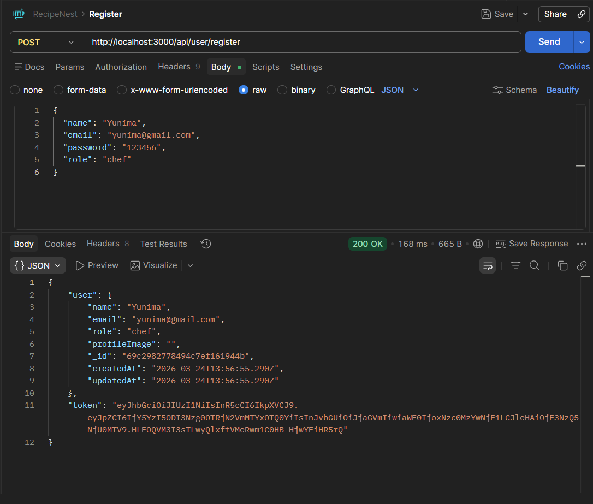
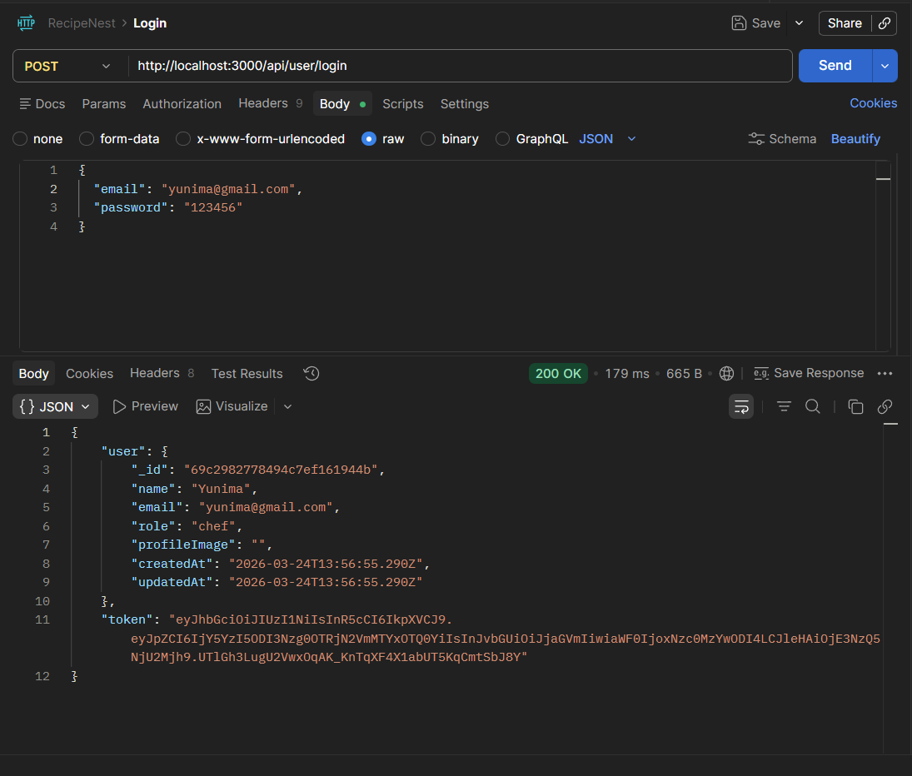
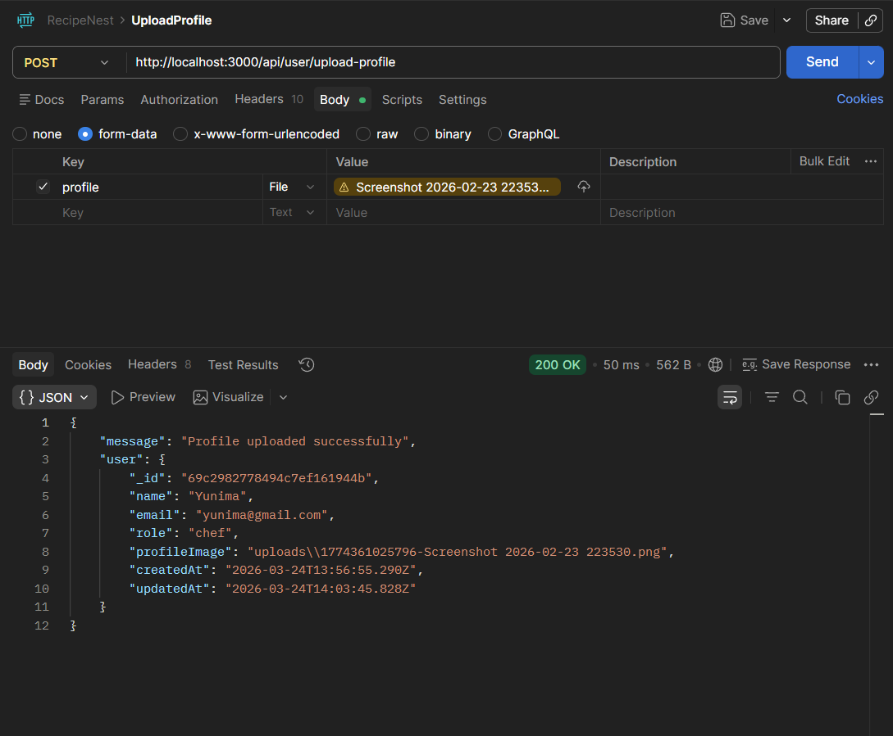
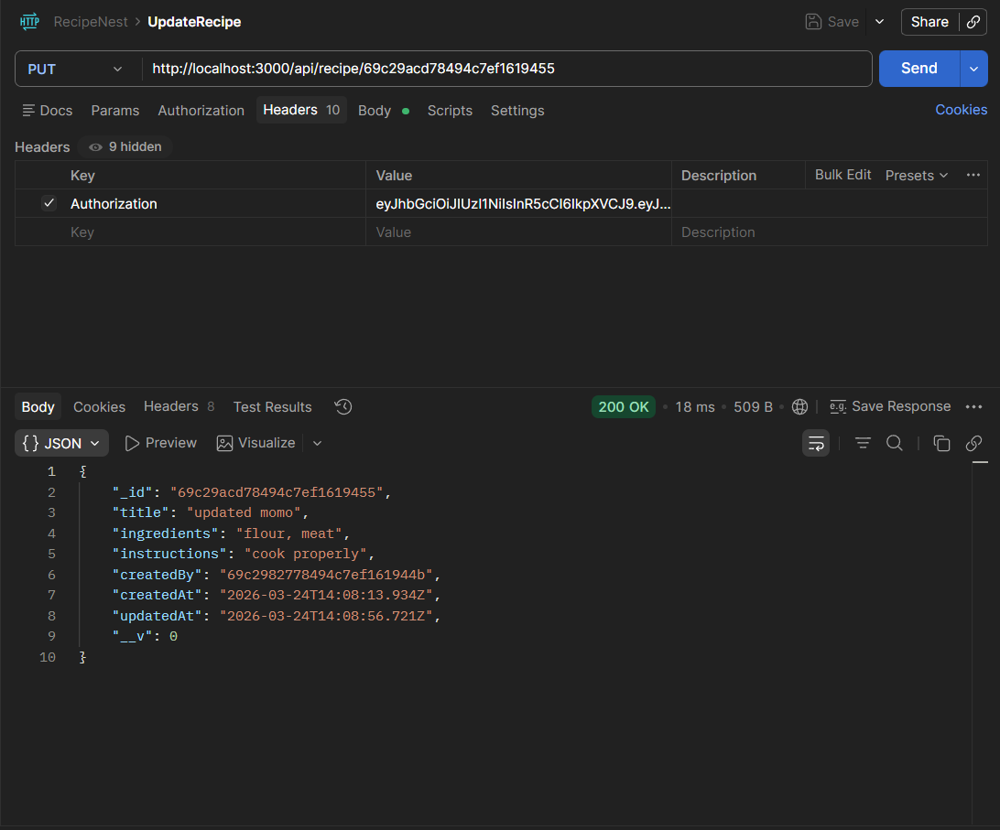
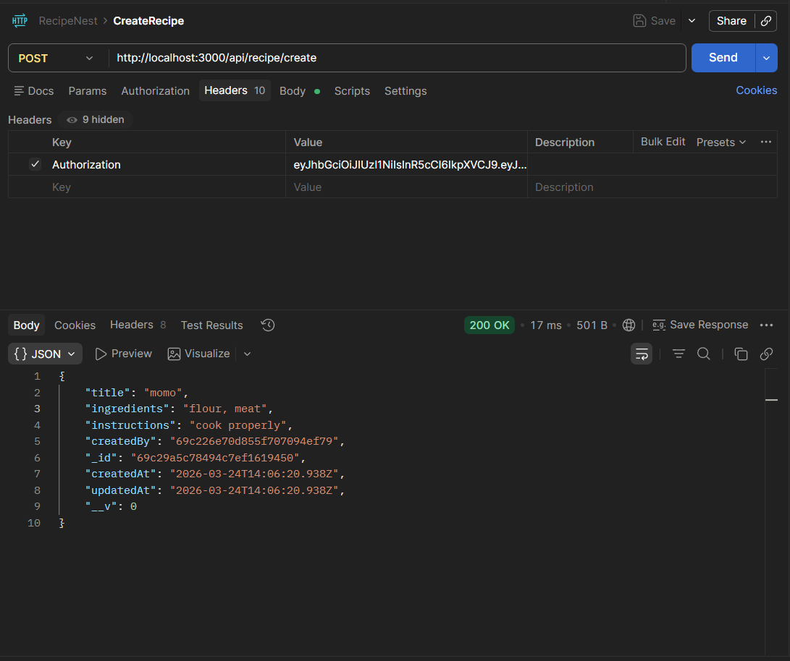
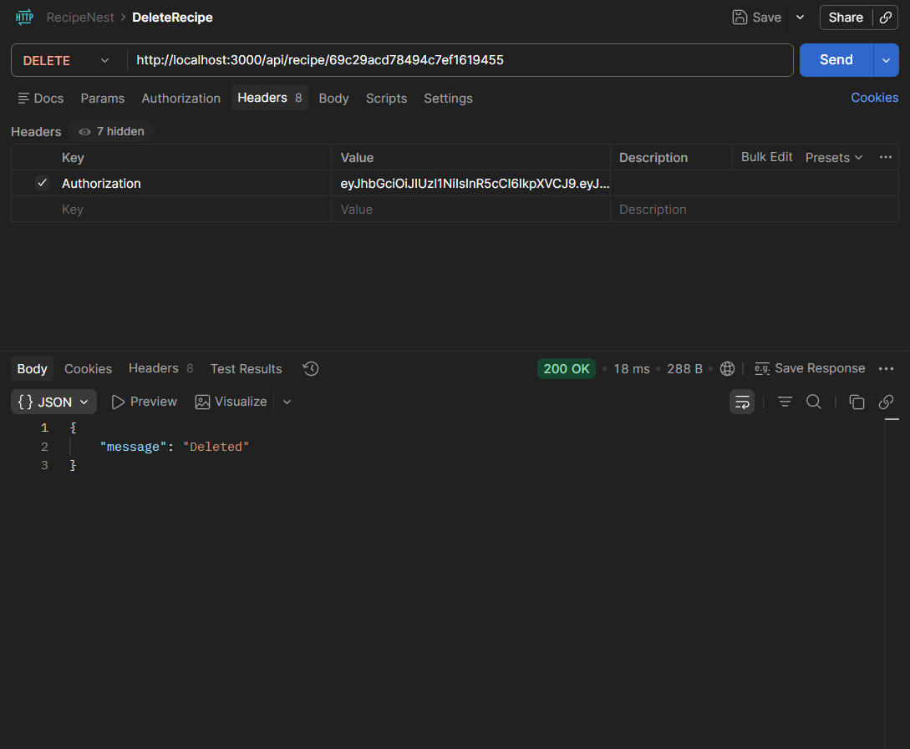

## Setup Instructions
npm install
npm run dev

## Technologies Used
Node.js
Express
MongoDB
JWT
Multer
bcrypt

## Features Implemented
- User Registration & Login
- JWT Authentication
- Role-based Authorization
- File Upload (Profile + Recipe)
- Protected Routes
- Recipe CRUD

## DEMO
Step 1: Register User

Step 2: Login

Step 3: Upload Profile Image

Step 4: Create Recipe (with image)

Step 5: Update Recipe

Step 6: Delete Recipe
